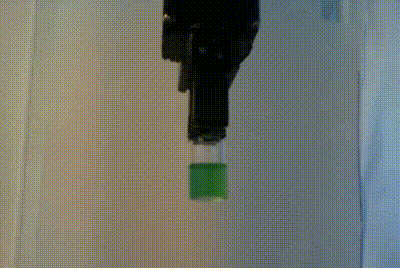

# Deep Learning for Viscosity Estimations
This repository contains the code for the Deep Viscosity Project. The project aims to create a 3D convolutional neural network that can predict the viscosities of fluids based on video data of the fluid in question. 

## Data
The data was collected using a robotic arm and web camera, both controlled by a Python script. The data consists of 50 different viscosities, each one recorded 19 times, yielding a total of 950 videos.  
Below are examples of the lowest and highest viscosity data that we collected

Lowest viscosity (1.0 cp)             |  Highest viscosity (939 cp)
:-------------------------:|:-------------------------:
  |  

## Setting up a virtual environment
To create a Conda environment using the `environment.yml` file in this repository, follow these steps:

1. Open a terminal or command prompt.
2. Navigate to the directory where the `environment.yml` file is located.
3. Run the following command to create the Conda environment:

    ```
    conda env create -f environment.yml
    ```

4. Conda will now download and install all the necessary packages specified in the `environment.yml` file.
5. Once the environment creation process is complete, activate the environment using the following command:

    ```
    conda activate deep_viscosity
    ```

You have successfully created and activated the Conda environment using the `environment.yml` file.


## Preprocessing the data
### The data
These videos need to be named according to the following convention: 
*(percentage of glycerol)_(test number).avi*

The allowed values for the percentages of glycerol can be found in the file `deep_viscosity/preprocessing/rename_data_files.py`.
### Preprocessing
To preprocess the data one should run the file `deep_viscosity/preprocessing/preprocessing.py`. Arguments must be passed to this script which should be done via the command line. The required arguments can be found in the file `deep_viscosity/preprocessing/utils/preprocess_args.py`. The exact command used for the preprocessing can be found in `deep_viscosity/preprocessing/arguments/preprocessing.txt`.

Below is an example of a video before preprocessing and a video stitched together of the frames after preprocessing. 
Before preprocessing (1.0 cp)             |  After preprocessing (1.0 cp)
:-------------------------:|:-------------------------:
  |  


## Training
Due to GPU requirements, the model was trained on an HPC cluster. However, it can also be trained via the command line using `deep_viscosity/train_model_shell.py`. 

## Inference
Run the `deep_viscosity/inference.py` script from the command line with the required arguments to estimate the viscosity of the trained model. 


